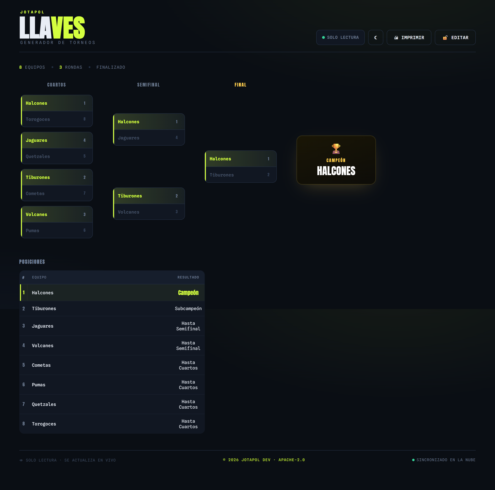
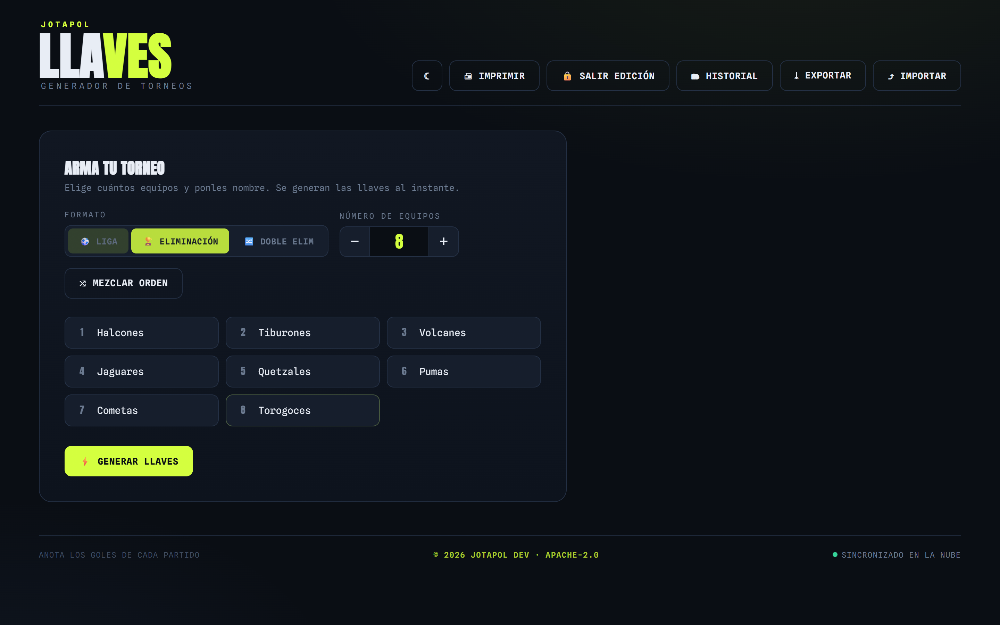
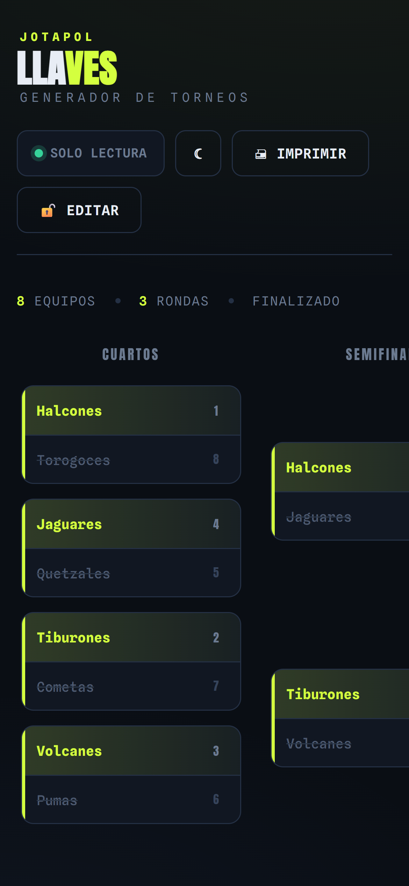

# LLAVES

Generador de torneos con llaves en vivo. Armás el torneo y se crea una sala con un código; quien tenga el link ve el cuadro actualizarse al instante, sin recargar y sin crear cuenta.

Pruebalo en **[llaves.jotapol.com](https://llaves.jotapol.com)**.



- **Tres formatos:** liga (ida o ida y vuelta), eliminación directa y doble eliminación con gran final.
- **Salas con código:** cada torneo tiene un código de 6 caracteres. El link para ver se comparte; el link de organizador trae la clave para editar.
- **En vivo:** los espectadores ven cada resultado al instante (Server-Sent Events).
- **Sin datos guardados:** todo vive en memoria y la sala se borra 24 horas después de su último cambio. Sin cuentas ni base de datos.
- **Posiciones automáticas:** tabla de liga con goles y diferencia; en eliminación, hasta qué ronda llegó cada equipo.
- **PDF tipo póster:** imprime el cuadro con el campeón al centro.
- **Descargar y abrir:** el torneo se baja como archivo `.json` para seguirlo otro día.

| Configurar | En el celular |
| --- | --- |
|  |  |

## Correrlo

Necesitás Node 18 o más nuevo.

```bash
npm install
npm start      # http://localhost:3000
npm test
```

| Variable | Para qué |
| --- | --- |
| `SALA_TTL_HORAS` | Horas sin cambios antes de borrar una sala. 24 por defecto. |
| `MAX_SALAS` | Salas activas como máximo. 500 por defecto. |
| `PORT` | Puerto, 3000 por defecto. |

## Cómo está hecho

Un solo `server.js` (Express) sirve la página y la API en el mismo puerto. La página es un único `public/index.html` sin build ni framework.

| Ruta | Quién | Qué hace |
| --- | --- | --- |
| `POST /api/salas` | todos | Crea una sala; devuelve el código y la clave de edición |
| `GET /api/salas/:codigo` | todos | Torneo de la sala |
| `GET /api/salas/:codigo/eventos` | todos | Cambios en vivo (SSE) |
| `POST /api/salas/:codigo` | con clave | Guarda y avisa a todos |

**Seguridad:** la clave se guarda solo como hash, se compara en tiempo constante y vive en el navegador del organizador. El servidor limita la creación de salas por IP, el tamaño de cada torneo y los espectadores por sala, y manda CSP estricta, `nosniff` y `frame-ancestors 'none'`.

---

## English

LLAVES is a live tournament bracket generator: league, single elimination and double elimination. Creating a tournament opens a room with a 6-character code; anyone with the link watches results update in real time (Server-Sent Events). Nothing is stored: rooms live in memory and expire 24 hours after their last change. Try it at [llaves.jotapol.com](https://llaves.jotapol.com).

```bash
npm install
npm start   # http://localhost:3000
```

---

Licencia [Apache-2.0](LICENSE). Hecho por **jotapol_** · [JOTAPOL DEV](https://github.com/jotapoldev)
